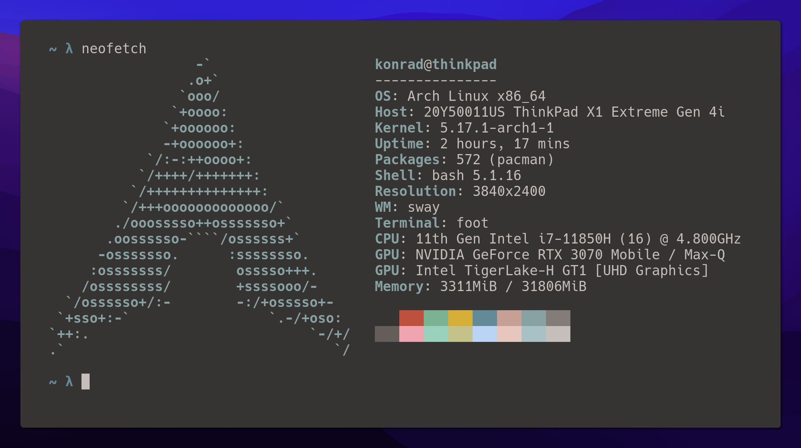

# 🖼️ Framer

Framer creates beautiful Sway window screenshots based on the currently focused Sway window by composing the window screenshot on top of the configured background with rounded corners and drop shadow effect.



## Usage

Framer should be run from a program [launcher](https://github.com/swaywm/sway/wiki#program-launchers).

```
framer
```

## Installation

### Requirements

- ImageMagick
- grim
- jq
